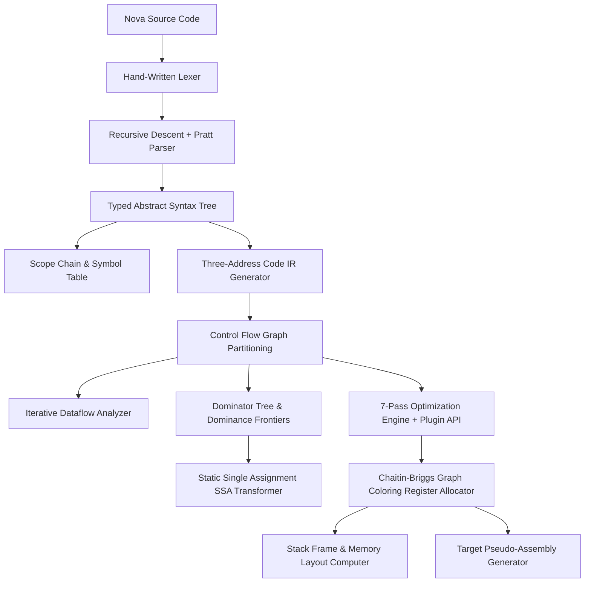

# CompilerGPT Universe — Architecture Specification

## System Overview
CompilerGPT Universe is an industrial-grade Compiler Intelligence & Visualization Platform for the **Nova** language.

---

## Compiler Subsystems

### 1. Lexical Scanner (`lexer.ts`)
Hand-written scanner maintaining 1-indexed line and column positions. Supports numbers, floats, string literals, identifiers, keywords, multi-line comments (`/* */`), and operators.

### 2. Parser & AST (`parser.ts`, `ast.ts`, `parsetable.ts`)
Top-down recursive descent parser integrated with a Pratt expression parser for operator precedence. Generates a typed AST and emits a step-by-step Shift-Reduce parse execution trace.

### 3. Semantic Analysis & Scope Tree (`semantic.ts`, `scope.ts`)
Manages nested lexical scopes (`Scope` objects). Resolves symbols, computes stack offsets, detects undeclared/duplicate variables and type mismatches, and builds a collapsible Lexical Scope Tree.

### 4. Intermediate Representation (`ir.ts`, `cfg.ts`)
Lowers AST into Three-Address Code (TAC) with linear temporaries (`t0, t1...`) and labels (`L0, L1...`). Partitions TAC into basic blocks and derives fallthrough, branch, and jump control flow edges.

### 5. Dataflow Analysis Framework (`dataflow.ts`)
Generic iterative fixpoint framework supporting:
- **Reaching Definitions**:
  $$IN[B] = \bigcup_{P \in \text{preds}(B)} OUT[P]$$
  $$OUT[B] = GEN[B] \cup (IN[B] \setminus KILL[B])$$
- **Live Variable Analysis**:
  $$OUT[B] = \bigcup_{S \in \text{succs}(B)} IN[S]$$
  $$IN[B] = USE[B] \cup (OUT[B] \setminus DEF[B])$$
- **Available Expressions**:
  $$IN[B] = \bigcap_{P \in \text{preds}(B)} OUT[P]$$
  $$OUT[B] = GEN[B] \cup (IN[B] \setminus KILL[B])$$
- **Def-Use ($DU$) & Use-Def ($UD$) Chains**

### 6. SSA & Dominator Analysis (`dominator.ts`, `ssa.ts`)
Computes Immediate Dominators ($idom$) and Dominance Frontiers ($DF$). Placed $\phi$-nodes at Iterated Dominance Frontiers:
$$\phi(v_{p1}, v_{p2})$$
Performs variable renaming ($x_0, x_1$) and provides an out-of-SSA deconstruction pass.

### 7. Chaitin-Briggs Register Allocator (`regalloc.ts`)
Computes liveness intervals, constructs an Interference Graph ($V=\text{vars}, E=\text{overlapping live ranges}$), and colors graph nodes with $K=8$ physical registers (`R0-R7`). When degree $\ge K$, selects optimal spill variables and emits memory stack offsets (`[rbp-N]`).

### 8. Memory Layout & Call Graph (`memorylayout.ts`, `callgraph.ts`)
Generates stack frame offsets for parameters, return address (`[rbp+8]`), saved frame pointer (`[rbp+0]`), local variables, and spill slots. Extracts interprocedural call graphs with caller/callee metrics and recursion indicators.
